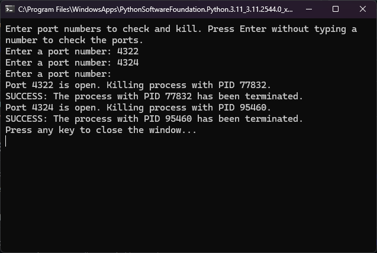

# Netstat-Tool

This Python program is a utility tool designed to automatically check if specific ports are open and, if so, terminating the processes using those ports.

## Usage

This can be particularly useful in scenarios where multiple instances of a development server are running simultaneously, or when a port is unexpectedly occupied by another process.

## How to Run
 
   To use the Port Killer Tool, you need to run the script using Python. It will prompt you to enter the port numbers you want to check and kill processes on. Here's how you can do it:

1. Open your terminal or command prompt.
2. Navigate to the directory containing the port_killer.py script.
3. Run the script by typing python port_killer.py and pressing Enter.
   
         python port_killer.py

The script will then ask you to enter the port numbers you want to check and kill processes on. After you've entered the port numbers, the script will automatically check each port and terminate any processes using those ports.

## Dependencies

   - Python: The script is written in Python and requires Python to be installed on your system.
   - Windows Command-Line Tools: The script utilizes netstat and taskkill, which are Windows command-line tools. Ensure these tools are available in your system's PATH.

## Limitations

   - Windows Specific: The script is designed to work on Windows operating systems and uses Windows-specific command-line tools. It may not work on other operating systems without modification.
   - Requires Administrative Privileges: The taskkill command may require administrative privileges to terminate processes. Running the script may prompt for administrative access.

## Screenshots

